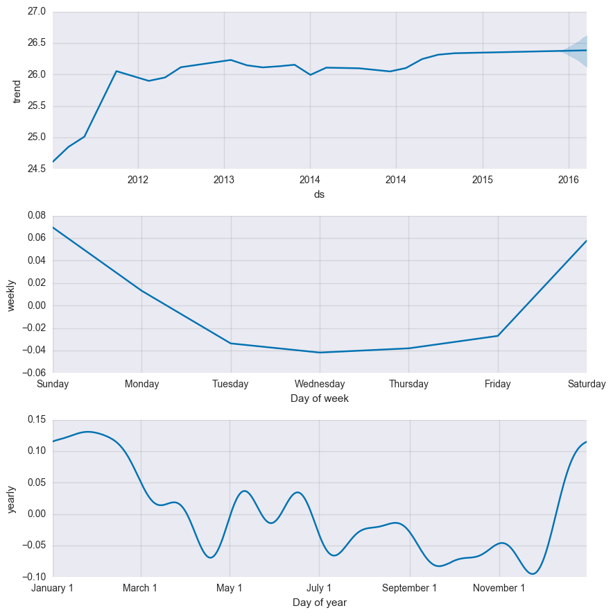
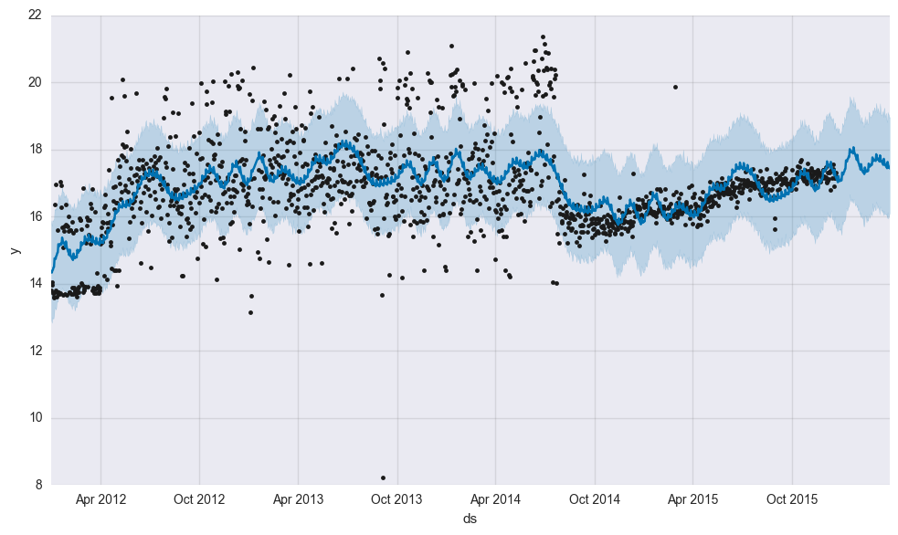

# Data Science Competition 2017
## Task Overview
For the multiplayer online game `EVE: Online` users can craft, develop and trade products,
materials and other goods freely on "space stations". Different forecasting and prediction
tasks based on these data is to be done.

### Task 1
The sales for five market segments (ships, ship equipment, ammunition and charges, manufacturing and
research) are to be forecasted for different horizons:

1. 24.12.15 to 01.01.16 (9 days)
2. weeks of january (30 days )
3. months of january to march

Each segment is represented by 5 individual products. Data is given with daily
granularity.

The forecasting is done with prophet, where details are available at the bottom of this document. The data is imputed with zeros for missing values, representing no sales
on the said day. Forecasts are made for 98 days, bigger granularities such as weeks and
months are then aggregated.

### Task 2
Three segment indices are to be forecasted for the same horizons as in task 1, again
the data is given with daily granularity. Again the data is modelled by prophet.

Example decomposition and model for the `cpi`:


Example forecast with uncertainty for `mpi`:


---
Different things have been tried to improve forecasts based on the given data. Several
methods for changepoint detection have been employed, where the task is to separate the
data into different stochastic processes, so a changepoint is a shift in the statistical
attributes of the data. No methods have been working as expected, and thus haven't been
used subsequently.
Different approaches have been compared by simulated historical forecasts (see bottom
of document).

Another thing that was tried was to remove outliers with filtering techniques such as
moving median. The forecasts didn't improve notably.

#### To be done
* use item attribute patches as changepoints to improve accuracy by accounting for
  external changes

### Task 3
For given data with monthly granularity and the market segments *ships*, *missile launchers* and *materials* (where each is defined as a set of a varying number of products) the market share for each segment is to be forecasted for the first quarter of the next year (2016).

As the sum of the forecasted shares cannot exceed 1 (or 100%) the problem differs substantially from the other three tasks. For the final solution an LSTM neural network is trained, which can model temporal dependency, and has a softmax activation function at the end, which *squashes* the values into `[0,1]`, and hence provides a probability distribution of the market shares. These are then taken as the respective market shares.

### Task 4
For a number of products with demand/supply data, stores (in this case "stations") and days for the year of 2016
the price and quantity tuple for January 2017 shall be forecasted.
The maximum number of products to be sold is given as the supply at the beginning of the
month. Nothing more can be sold.
Hence the task is no forecasting, but rather an optimization problem.

As a simple approximate solution the task is "solved" by estimating the price and quantity
per day, product and station via a Evolutionary Strategy optimization method per product.
The cost function is to be maximized, solutions which exceed the monthly supply are marked
as infeasible by returning `0`. For an extensive overview on other constraint handling
methods for genetic programming/evolution strategies see [2].

#### Possible Improvements
* The basic maximization of said cost function can be extended by
accepting only prices which are within the IRQ (+1.5/-1.5 times the forecasted price)
epsilon region of the forecasted price. The same applies to forecasted quantity.
* The initial vectors can be initialized with the forecasted demand and price
instead of just zero.

## Installation
### Notebooks
The notebooks need two extensions to work properly:


for beautiful progress bars with `tqdm` and `ipywidgets`:

```
jupyter nbextension enable --py --sys-prefix widgetsnbextension
```

## To be done
Due to time issues some tasks were ignored, and which are yet to be done:
* the lstm solution to task 3 should be evaluated against VAR with softmax
specifically or with simulated historical forecasting in general


## Concepts
### Prophet Models
The model is based on the additive decomposition, where the signal is decomposed in additive, conceptual components:

* `g(t)`: growth (piecewise linear segmented trend modelled by the logistic growth model) with optional changepoints
* `s(t)`: periodicity such as weekly, monthly or annual changes, modelled by a fourier transformation
* `h(t)`: holidays, unused
* residuals: signals the mentioned components isn't modelling

For details see [1].

### Simulated Historical Forecasts
Due to the i.i.d. assumption of cross validation and similar approaches in machine
learning we cannot simply select training and testing/evaluation data for time series
analysis. Henceforth different, increasing horizons are chosen, where the partitions are
then used for training and testing and subsequently evaluated.

Example:
Say we have daily data for two years. The forecasting horizon is 31 days.
We partition the data (starting at the end of the first year) into training data:
* first year as training
* second year as testing data
as the first iteration of shf.
The next iteration then divides the data into `end of first year + chosen granularity` 
as training and the rest as evaluation data. The granularity can be daily, monthly,
quarterly, or with enough data even yearly or more.
The empirical distribution of accuracy measurements of each of these partitions can be
evaluated subsequently to determine the overall accuracy of the model.

NB: the accuracy is expected to improve with more training data and less testing data.

## References
* [[1] Taylor, Lethan: Forecasting at Scale (2017)](https://facebookincubator.github.io/prophet/static/prophet_paper_20170113.pdf)
* [[2] Kramer : A Review of Constraint-Handling Techniques for Evolution Strategies (2010)](https://www.hindawi.com/journals/acisc/2010/185063/)